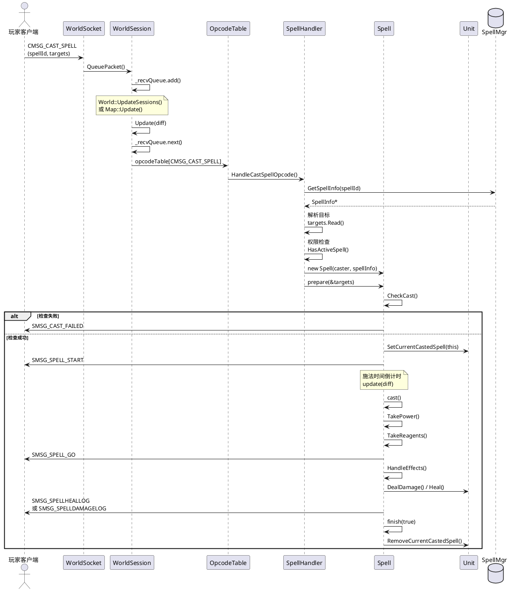

# AzerothCore 技能系统学习指南

## 📚 目录
1. [系统概述](#系统概述)
2. [完整数据流](#完整数据流)
3. [时序图](#时序图)
4. [核心类和文件](#核心类和文件)
5. [关键函数详解](#关键函数详解)
6. [学习路径](#学习路径)
7. [实战示例](#实战示例)

---

## 系统概述

AzerothCore的技能系统是一个复杂的多层架构，从客户端发送技能释放请求到服务器处理并返回结果，涉及网络层、会话层、游戏逻辑层等多个模块。

### 核心设计理念
- **异步处理**: 网络包通过队列异步处理
- **状态机**: 技能施放过程使用状态机管理
- **多槽位管理**: Unit可以同时维护多个不同类型的技能
- **触发器系统**: 支持技能触发其他技能

---

## 完整数据流

### 阶段1: 客户端发送技能包 → 服务器接收

```
客户端 (WoW Client)
    ↓
[CMSG_CAST_SPELL] 网络包
    ↓ (TCP/IP)
WorldSocket::ReadHandler()
    ↓
WorldSocket::ReadDataHandler()
    ↓
WorldSession::QueuePacket()  // 加入接收队列
    ↓
_recvQueue (LockedQueue)
```

**关键文件**: 
- `src/server/game/Server/WorldSocket.cpp`
- `src/server/game/Server/WorldSession.cpp`

---

### 阶段2: 网络包分发与处理

```
World::UpdateSessions() 或 Map::Update()
    ↓
WorldSession::Update(diff, filter)
    ↓
从 _recvQueue 取出包
    ↓
opcodeTable[CMSG_CAST_SPELL] 查找处理器
    ↓
ClientOpcodeHandler::Call()
    ↓
WorldSession::HandleCastSpellOpcode()
```

**处理器注册** (`src/server/game/Server/Protocol/Opcodes.cpp:433`):
```cpp
DEFINE_HANDLER(CMSG_CAST_SPELL, STATUS_LOGGEDIN, PROCESS_THREADSAFE, 
               &WorldSession::HandleCastSpellOpcode);
```

**处理模式**:
- `PROCESS_INPLACE`: 立即处理
- `PROCESS_THREADUNSAFE`: 在 World::UpdateSessions() 中处理
- `PROCESS_THREADSAFE`: 在 Map::Update() 中处理（技能包属于此类）

---

### 阶段3: HandleCastSpellOpcode 详细流程

**文件**: `src/server/game/Handlers/SpellHandler.cpp:376-565`

```cpp
void WorldSession::HandleCastSpellOpcode(WorldPacket& recvPacket)
{
    // 1. 解析包数据
    uint32 spellId;
    uint8 castCount, castFlags;
    recvPacket >> castCount >> spellId >> castFlags;
    
    // 2. 验证施法者
    Unit* mover = _player->m_mover;
    if (mover != _player && mover->IsPlayer())
        return; // 远程控制检查
    
    // 3. 获取技能信息
    SpellInfo const* spellInfo = sSpellMgr->GetSpellInfo(spellId);
    if (!spellInfo)
        return; // 未知技能
    
    // 4. 技能队列处理
    if (!_player->CanExecutePendingSpellCastRequest(spellInfo))
    {
        if (_player->CanRequestSpellCast(spellInfo))
        {
            // 加入技能队列，稍后执行
            _player->SpellQueue.emplace_back(spellId, ...);
            return;
        }
    }
    
    // 5. 读取目标信息
    SpellCastTargets targets;
    targets.Read(recvPacket, mover);
    HandleClientCastFlags(recvPacket, castFlags, targets);
    
    // 6. 权限检查
    if (mover->IsPlayer())
    {
        // 检查玩家是否学会该技能
        if (!mover->ToPlayer()->HasActiveSpell(spellId))
            return;
    }
    
    // 7. 创建Spell对象
    Spell* spell = new Spell(mover, spellInfo, TRIGGERED_NONE);
    spell->m_cast_count = castCount;
    
    // 8. 准备施法
    spell->prepare(&targets);
}
```

---

### 阶段4: Spell::prepare() - 施法准备

**文件**: `src/server/game/Spells/Spell.cpp:3656-3733`

```cpp
SpellCastResult Spell::prepare(SpellCastTargets const* targets)
{
    // 1. 初始化目标
    m_targets = *targets;
    
    // 2. 检查施法条件
    SpellCastResult result = CheckCast(true);
    if (result != SPELL_CAST_OK)
    {
        SendCastResult(result);
        finish(false);
        return result;
    }
    
    // 3. 处理站立状态
    if (m_caster->IsSitState())
        m_caster->SetStandState(UNIT_STAND_STATE_STAND);
    
    // 4. 设置当前施法
    m_caster->SetCurrentCastedSpell(this);
    
    // 5. 发送施法开始包
    SendSpellStart();
    
    // 6. 触发GCD（全局冷却）
    if (!HasTriggeredCastFlag(TRIGGERED_IGNORE_GCD))
        TriggerGlobalCooldown();
    
    // 7. 即时施法直接执行
    if (!m_casttime && GetCurrentContainer() == CURRENT_GENERIC_SPELL)
        cast(true);
    
    return SPELL_CAST_OK;
}
```

**CheckCast() 检查项**:
- 施法距离
- 法力/能量消耗
- 冷却时间
- 目标有效性
- 地形限制
- 战斗状态

---

### 阶段5: Spell::update() - 施法更新

**文件**: `src/server/game/Spells/Spell.cpp:4448-4501`

```cpp
void Spell::update(uint32 difftime)
{
    switch (m_spellState)
    {
        case SPELL_STATE_PREPARING:
        {
            // 施法时间倒计时
            if (m_timer > 0)
            {
                if (difftime >= m_timer)
                    m_timer = 0;
                else
                    m_timer -= difftime;
            }
            
            // 施法完成，执行效果
            if (m_timer == 0)
            {
                cast(true);
                m_spellState = SPELL_STATE_CASTING;
            }
            break;
        }
        
        case SPELL_STATE_CASTING:
        {
            // 引导法术处理
            if (m_spellInfo->IsChanneled())
            {
                if (m_timer == 0)
                {
                    SendChannelUpdate(0);
                    finish();
                }
                else if (!UpdateChanneledTargetList())
                {
                    // 目标丢失，中断施法
                    finish();
                }
            }
            break;
        }
    }
}
```

---

### 阶段6: Spell::cast() - 执行施法

**文件**: `src/server/game/Spells/Spell.cpp:3766-3988`

```cpp
void Spell::_cast(bool skipCheck)
{
    // 1. 更新指针（防止对象已销毁）
    if (!UpdatePointers())
    {
        cancel();
        return;
    }
    
    // 2. 消耗资源
    if (!HasTriggeredCastFlag(TRIGGERED_IGNORE_POWER_AND_REAGENT_COST))
    {
        TakePower();      // 消耗法力/能量
        TakeReagents();   // 消耗材料
    }
    
    // 3. 触发冷却
    SendSpellCooldown();
    
    // 4. 准备命中处理
    PrepareScriptHitHandlers();
    
    // 5. 处理发射阶段（弹道法术）
    HandleLaunchPhase();
    
    // 6. 发送施法生效包
    SendSpellGo();
    
    // 7. 触发Proc系统
    if (m_originalCaster)
    {
        m_originalCaster->ProcDamageAndSpell(...);
    }
    
    // 8. 处理即时效果
    handle_immediate();
    
    // 9. 处理延迟效果
    if (m_delayMoment)
        handle_delayed(m_delayMoment);
    
    // 10. 完成施法
    finish(true);
}
```

---

### 阶段7: 效果处理

```cpp
void Spell::_handle_immediate_phase()
{
    // 遍历所有效果
    for (uint32 j = 0; j < MAX_SPELL_EFFECTS; ++j)
    {
        if (!m_spellInfo->Effects[j].IsEffect())
            continue;
        
        // 调用效果处理器
        HandleEffects(nullptr, nullptr, nullptr, j, SPELL_EFFECT_HANDLE_HIT);
    }
    
    // 处理物品目标
    for (ItemTargetInfo& ihit : m_UniqueItemInfo)
        DoAllEffectOnTarget(&ihit);
}
```

**常见效果类型**:
- `SPELL_EFFECT_SCHOOL_DAMAGE`: 造成伤害
- `SPELL_EFFECT_HEAL`: 治疗
- `SPELL_EFFECT_APPLY_AURA`: 施加光环
- `SPELL_EFFECT_SUMMON`: 召唤
- `SPELL_EFFECT_TELEPORT_UNITS`: 传送

---

### 阶段8: 发送结果给客户端

```
Spell::SendSpellGo()
    ↓
构建 SMSG_SPELL_GO 包
    ↓
WorldSession::SendPacket()
    ↓
WorldSocket::SendPacket()
    ↓
TCP发送到客户端
    ↓
客户端播放技能动画和特效
```

---

## 时序图



---

## 核心类和文件

### 1. 网络层

#### WorldSocket
**文件**: `src/server/game/Server/WorldSocket.h/cpp`
- 管理TCP连接
- 接收和发送网络包
- 包加密/解密

#### WorldSession
**文件**: `src/server/game/Server/WorldSession.h/cpp`
- 代表一个玩家会话
- 管理接收队列 `_recvQueue`
- 分发网络包到对应处理器
- 每次Update最多处理150个包

**关键方法**:
```cpp
bool Update(uint32 diff, PacketFilter& updater);
void QueuePacket(WorldPacket* packet);
void SendPacket(WorldPacket const* packet);
```

---

### 2. 协议层

#### OpcodeTable
**文件**: `src/server/game/Server/Protocol/Opcodes.h/cpp`
- 注册所有操作码和处理器
- 定义处理模式（线程安全/不安全）

**技能相关操作码**:
```cpp
CMSG_CAST_SPELL           = 0x12E  // 施放技能
CMSG_CANCEL_CAST          = 0x12F  // 取消施法
CMSG_CANCEL_CHANNELLING   = 0x1B9  // 取消引导
SMSG_SPELL_START          = 0x131  // 施法开始
SMSG_SPELL_GO             = 0x132  // 施法生效
SMSG_SPELL_FAILURE        = 0x133  // 施法失败
```

---

### 3. 处理器层

#### SpellHandler
**文件**: `src/server/game/Handlers/SpellHandler.cpp`
- 处理所有技能相关的网络包
- 验证权限和条件
- 创建Spell对象

**关键函数**:
```cpp
void HandleCastSpellOpcode(WorldPacket& recvPacket);
void HandleCancelCastOpcode(WorldPacket& recvPacket);
void HandleCancelChanneling(WorldPacket& recvData);
```

---

### 4. 游戏逻辑层

#### Spell
**文件**: `src/server/game/Spells/Spell.h/cpp` (9136行，核心类)

**状态枚举**:
```cpp
enum SpellState
{
    SPELL_STATE_NULL      = 0,
    SPELL_STATE_PREPARING = 1,  // 准备中（施法时间）
    SPELL_STATE_CASTING   = 2,  // 施放中（引导）
    SPELL_STATE_FINISHED  = 3,  // 已完成
    SPELL_STATE_IDLE      = 4,
    SPELL_STATE_DELAYED   = 5   // 延迟
};
```

**核心方法**:
```cpp
SpellCastResult prepare(SpellCastTargets const* targets);
void update(uint32 difftime);
void cast(bool skipCheck = false);
void finish(bool ok = true);
void cancel(bool bySelf = false);

// 检查
SpellCastResult CheckCast(bool strict);
SpellCastResult CheckRange(bool strict);
SpellCastResult CheckPower();

// 资源消耗
void TakePower();
void TakeReagents();

// 效果处理
void HandleEffects(Unit* pUnitTarget, Item* pItemTarget, 
                   GameObject* pGOTarget, uint32 i, 
                   SpellEffectHandleMode mode);

// 网络包
void SendSpellStart();
void SendSpellGo();
void SendCastResult(SpellCastResult result);
```

---

#### Unit
**文件**: `src/server/game/Entities/Unit/Unit.h/cpp` (2248行)

**技能槽位**:
```cpp
enum CurrentSpellTypes
{
    CURRENT_MELEE_SPELL      = 0,  // 近战攻击
    CURRENT_GENERIC_SPELL    = 1,  // 普通技能
    CURRENT_CHANNELED_SPELL  = 2,  // 引导技能
    CURRENT_AUTOREPEAT_SPELL = 3   // 自动重复（射击）
};

#define CURRENT_MAX_SPELL 4
```

**技能管理**:
```cpp
Spell* m_currentSpells[CURRENT_MAX_SPELL];

void SetCurrentCastedSpell(Spell* spell);
Spell* GetCurrentSpell(CurrentSpellTypes type) const;
void InterruptSpell(CurrentSpellTypes type, bool withDelayed = true);
bool IsNonMeleeSpellCast(bool withDelayed = true);

// 施法接口
void CastSpell(Unit* victim, uint32 spellId, bool triggered = false);
void CastSpell(Unit* victim, SpellInfo const* spellInfo, bool triggered = false);
```

**更新循环**:
```cpp
void Unit::Update(uint32 diff)
{
    // 更新所有当前施法
    for (uint32 i = 0; i < CURRENT_MAX_SPELL; ++i)
    {
        if (m_currentSpells[i])
            m_currentSpells[i]->update(diff);
    }
    
    // 其他更新...
}
```

---

#### SpellInfo
**文件**: `src/server/game/Spells/SpellInfo.h/cpp`
- 技能的静态数据（从DBC加载）
- 施法时间、冷却、消耗、效果等

**关键属性**:
```cpp
uint32 Id;                    // 技能ID
uint32 Category;              // 技能类别
uint32 CastTimeEntry;         // 施法时间
uint32 RecoveryTime;          // 冷却时间
uint32 CategoryRecoveryTime;  // 类别冷却
SpellPowerEntry PowerCosts;   // 能量消耗
SpellEffectInfo Effects[MAX_SPELL_EFFECTS];  // 效果
```

---

#### SpellCastTargets
**文件**: `src/server/game/Spells/Spell.h/cpp`
- 封装技能目标信息

```cpp
class SpellCastTargets
{
    void Read(ByteBuffer& data, Unit* caster);
    void Write(ByteBuffer& data);
    
    Unit* GetUnitTarget() const;
    GameObject* GetGOTarget() const;
    Item* GetItemTarget() const;
    Position const* GetDstPos() const;
    
private:
    uint32 m_targetMask;
    ObjectGuid m_objectTargetGUID;
    ObjectGuid m_itemTargetGUID;
    SpellDestination m_src;
    SpellDestination m_dst;
};
```

---

### 5. 数据层

#### SpellMgr
**文件**: `src/server/game/Spells/SpellMgr.h/cpp`
- 管理所有技能数据
- 从DBC文件加载

```cpp
class SpellMgr
{
    SpellInfo const* GetSpellInfo(uint32 spellId) const;
    void LoadSpellInfoStore();
    
private:
    SpellInfoMap mSpellInfoMap;
};

#define sSpellMgr SpellMgr::instance()
```

---

## 关键函数详解

### 1. WorldSession::Update()

**调用时机**: 
- `World::UpdateSessions()` (线程不安全的包)
- `Map::Update()` (线程安全的包)

**处理流程**:
```cpp
bool WorldSession::Update(uint32 diff, PacketFilter& updater)
{
    // 1. 检查超时
    if (IsConnectionIdle())
        m_Socket->CloseSocket();
    
    // 2. 处理接收队列
    WorldPacket* packet = nullptr;
    const uint32 MAX_PACKETS = 150;  // 防止阻塞
    uint32 processedPackets = 0;
    
    while (m_Socket && _recvQueue.next(packet, updater))
    {
        if (processedPackets >= MAX_PACKETS)
            break;
        
        // 3. 获取处理器
        OpcodeClient opcode = packet->GetOpcode();
        ClientOpcodeHandler const* opHandle = opcodeTable[opcode];
        
        // 4. DOS保护
        DosProtection::Policy policy = AntiDOS.EvaluateOpcode(*packet);
        if (policy == Policy::Kick)
            break;
        
        // 5. 状态检查
        if (opHandle->Status > GetSessionStatus())
        {
            LogUnexpectedOpcode(packet, "STATUS");
            continue;
        }
        
        // 6. 调用处理器
        try {
            opHandle->Call(this, *packet);
        }
        catch (ByteBufferException const&) {
            LOG_ERROR("ByteBuffer exception");
        }
        
        delete packet;
        processedPackets++;
    }
    
    // 7. 处理登出
    if (ShouldLogOut())
        LogoutPlayer(true);
    
    return true;
}
```

---

### 2. Spell::CheckCast()

**文件**: `src/server/game/Spells/Spell.cpp`

```cpp
SpellCastResult Spell::CheckCast(bool strict)
{
    // 1. 检查施法者状态
    if (m_caster->HasUnitState(UNIT_STATE_CASTING) && !m_spellInfo->IsChanneled())
        return SPELL_FAILED_SPELL_IN_PROGRESS;
    
    // 2. 检查距离
    SpellCastResult castResult = CheckRange(strict);
    if (castResult != SPELL_CAST_OK)
        return castResult;
    
    // 3. 检查能量
    if (!HasTriggeredCastFlag(TRIGGERED_IGNORE_POWER_AND_REAGENT_COST))
    {
        castResult = CheckPower();
        if (castResult != SPELL_CAST_OK)
            return castResult;
    }
    
    // 4. 检查冷却
    if (m_caster->IsPlayer())
    {
        if (m_caster->ToPlayer()->HasSpellCooldown(m_spellInfo->Id))
            return SPELL_FAILED_NOT_READY;
    }
    
    // 5. 检查目标
    if (!m_targets.GetUnitTarget())
    {
        if (m_spellInfo->NeedsExplicitUnitTarget())
            return SPELL_FAILED_BAD_TARGETS;
    }
    
    // 6. 检查视线
    if (m_spellInfo->AttributesEx2 & SPELL_ATTR2_IGNORE_LINE_OF_SIGHT)
    {
        // 忽略视线检查
    }
    else if (!m_caster->IsWithinLOSInMap(target))
    {
        return SPELL_FAILED_LINE_OF_SIGHT;
    }
    
    // 7. 检查地形
    // 8. 检查免疫
    // 9. 检查装备
    // ... 更多检查
    
    return SPELL_CAST_OK;
}
```

---

### 3. Unit::CastSpell()

**简化接口**:
```cpp
void Unit::CastSpell(Unit* victim, uint32 spellId, bool triggered)
{
    SpellInfo const* spellInfo = sSpellMgr->GetSpellInfo(spellId);
    if (!spellInfo)
        return;
    
    CastSpell(victim, spellInfo, triggered);
}

void Unit::CastSpell(Unit* victim, SpellInfo const* spellInfo, bool triggered)
{
    TriggerCastFlags triggerFlags = triggered ? TRIGGERED_FULL_MASK : TRIGGERED_NONE;
    
    Spell* spell = new Spell(this, spellInfo, triggerFlags);
    
    SpellCastTargets targets;
    targets.SetUnitTarget(victim);
    
    spell->prepare(&targets);
}
```

---

### 4. Spell::HandleEffects()

**效果分发**:
```cpp
void Spell::HandleEffects(Unit* pUnitTarget, Item* pItemTarget, 
                          GameObject* pGOTarget, uint32 effectIndex,
                          SpellEffectHandleMode mode)
{
    SpellEffectInfo const& effect = m_spellInfo->Effects[effectIndex];
    
    switch (effect.Effect)
    {
        case SPELL_EFFECT_SCHOOL_DAMAGE:
            EffectSchoolDMG(effectIndex);
            break;
        case SPELL_EFFECT_HEAL:
            EffectHeal(effectIndex);
            break;
        case SPELL_EFFECT_APPLY_AURA:
            EffectApplyAura(effectIndex);
            break;
        case SPELL_EFFECT_SUMMON:
            EffectSummon(effectIndex);
            break;
        // ... 100+ 种效果类型
    }
}
```

---

## 学习路径

### 第一阶段：基础理解（1-2周）

#### 1. 网络基础
- [ ] 阅读 `WorldSocket.h/cpp`
- [ ] 理解TCP包的接收和发送
- [ ] 了解 `WorldPacket` 结构

#### 2. 会话管理
- [ ] 阅读 `WorldSession.h` (重点关注Update方法)
- [ ] 理解 `_recvQueue` 队列机制
- [ ] 学习包过滤器 `PacketFilter`

#### 3. 操作码系统
- [ ] 阅读 `Opcodes.h` 中的枚举定义
- [ ] 查看 `Opcodes.cpp` 中的处理器注册
- [ ] 理解 `PROCESS_THREADSAFE` vs `PROCESS_THREADUNSAFE`

**实践任务**:
```cpp
// 添加日志，追踪一个技能包的处理
LOG_DEBUG("spell.trace", "Received CMSG_CAST_SPELL: spellId={}", spellId);
```

---

### 第二阶段：技能处理流程（2-3周）

#### 4. SpellHandler
- [ ] 完整阅读 `SpellHandler.cpp`
- [ ] 重点理解 `HandleCastSpellOpcode()`
- [ ] 学习目标解析 `SpellCastTargets::Read()`

#### 5. Spell类核心
- [ ] 阅读 `Spell.h` 了解类结构
- [ ] 学习 `prepare()` 方法
- [ ] 学习 `update()` 状态机
- [ ] 学习 `cast()` 执行流程
- [ ] 学习 `finish()` 清理流程

#### 6. 检查系统
- [ ] 深入 `CheckCast()` 的各种检查
- [ ] 理解 `SpellCastResult` 枚举
- [ ] 学习距离、视线、能量检查

**实践任务**:
```cpp
// 创建一个自定义技能，添加特殊检查
SpellCastResult MyCustomCheck()
{
    if (/* 自定义条件 */)
        return SPELL_FAILED_CUSTOM_ERROR;
    return SPELL_CAST_OK;
}
```

---

### 第三阶段：Unit与技能槽位（2周）

#### 7. Unit技能管理
- [ ] 阅读 `Unit.h` 中的技能相关部分
- [ ] 理解 `CurrentSpellTypes` 枚举
- [ ] 学习 `m_currentSpells` 数组管理
- [ ] 理解 `SetCurrentCastedSpell()`

#### 8. 技能打断
- [ ] 学习 `InterruptSpell()`
- [ ] 理解打断条件和时机
- [ ] 学习 `AURA_INTERRUPT_FLAG`

**实践任务**:
```cpp
// 实现一个技能打断另一个技能的逻辑
if (victim->IsNonMeleeSpellCast(false))
{
    victim->InterruptNonMeleeSpells(false);
}
```

---

### 第四阶段：效果系统（3-4周）

#### 9. 效果处理
- [ ] 阅读 `SpellEffects.cpp`
- [ ] 学习常见效果：伤害、治疗、光环
- [ ] 理解 `SpellEffectHandleMode`

#### 10. 光环系统
- [ ] 阅读 `SpellAuras.h/cpp`
- [ ] 学习 `Aura` 和 `AuraEffect`
- [ ] 理解周期性光环的更新

#### 11. 目标选择
- [ ] 阅读 `SpellTargetSelector.cpp`
- [ ] 理解 `TARGET_*` 枚举
- [ ] 学习AOE目标选择算法

**实践任务**:
```cpp
// 创建一个自定义AOE技能
void SelectTargetsInCone()
{
    std::list<Unit*> targets;
    // 实现锥形范围选择
}
```

---

### 第五阶段：高级特性（3-4周）

#### 12. 触发系统
- [ ] 学习 `TriggerCastFlags`
- [ ] 理解触发技能的递归处理
- [ ] 学习 `TRIGGERED_FULL_MASK`

#### 13. Proc系统
- [ ] 阅读 `SpellAuraEffects.cpp` 中的Proc处理
- [ ] 理解 `PROC_FLAG_*` 枚举
- [ ] 学习Proc触发条件

#### 14. 冷却系统
- [ ] 学习 `SpellHistory.h/cpp`
- [ ] 理解技能冷却和类别冷却
- [ ] 学习GCD（全局冷却）

#### 15. 脚本系统
- [ ] 阅读 `SpellScript.h`
- [ ] 学习如何编写技能脚本
- [ ] 理解Hook点

**实践任务**:
```cpp
// 编写一个技能脚本
class spell_my_custom_spell : public SpellScript
{
    PrepareSpellScript(spell_my_custom_spell);
    
    void HandleOnHit()
    {
        // 自定义逻辑
    }
    
    void Register() override
    {
        OnHit += SpellHitFn(spell_my_custom_spell::HandleOnHit);
    }
};
```

---

### 第六阶段：性能优化与调试（2周）

#### 16. 性能分析
- [ ] 理解为什么限制每次Update处理150个包
- [ ] 学习技能对象池（如果有）
- [ ] 分析热点函数

#### 17. 调试技巧
- [ ] 使用 `LOG_DEBUG` 追踪技能流程
- [ ] 学习使用GDB调试技能问题
- [ ] 理解常见崩溃原因

**调试示例**:
```cpp
// 在关键点添加日志
LOG_DEBUG("spell.debug", "Spell {} state={} timer={}", 
          m_spellInfo->Id, m_spellState, m_timer);
```

---

## 实战示例

### 示例1：追踪一个火球术的完整流程

```cpp
// 1. 客户端发送 CMSG_CAST_SPELL
// spellId = 133 (火球术)
// target = 敌对NPC

// 2. WorldSession::HandleCastSpellOpcode()
LOG_DEBUG("spell", "Player {} casting Fireball on target {}", 
          _player->GetName(), target->GetName());

// 3. Spell::prepare()
LOG_DEBUG("spell", "Fireball prepare: castTime={}ms", m_casttime);

// 4. Spell::update() - 每帧调用
// m_timer 从 3500ms 倒计时到 0

// 5. Spell::cast()
LOG_DEBUG("spell", "Fireball cast: consuming {} mana", powerCost);

// 6. Spell::HandleEffects()
// SPELL_EFFECT_SCHOOL_DAMAGE
uint32 damage = CalculateDamage();
LOG_DEBUG("spell", "Fireball deals {} fire damage", damage);

// 7. Unit::DealDamage()
target->ModifyHealth(-damage);

// 8. 发送 SMSG_SPELLDAMAGELOG 给客户端
```

---

### 示例2：实现一个自定义即时治疗技能

```cpp
// 1. 在数据库中创建技能
INSERT INTO spell_dbc VALUES (
    999999,           -- Id
    'Custom Heal',    -- Name
    0,                -- CastTime (即时)
    1500,             -- Cooldown (1.5秒)
    ...
);

// 2. 添加效果
INSERT INTO spell_effect VALUES (
    999999,           -- SpellId
    0,                -- EffectIndex
    6,                -- Effect (SPELL_EFFECT_HEAL)
    500,              -- BasePoints (治疗500点)
    ...
);

// 3. 玩家施放
player->CastSpell(target, 999999, false);

// 4. 流程
// HandleCastSpellOpcode() 
//   -> Spell::prepare() 
//   -> CheckCast() (检查目标、距离等)
//   -> cast() (因为castTime=0，立即执行)
//   -> EffectHeal() 
//   -> target->ModifyHealth(+500)
//   -> SendSpellGo()
```

---

### 示例3：实现技能打断机制

```cpp
// 当玩家受到伤害时打断施法
void Unit::DealDamage(Unit* victim, uint32 damage, ...)
{
    // 检查受害者是否在施法
    if (victim->IsNonMeleeSpellCast(false))
    {
        Spell* spell = victim->GetCurrentSpell(CURRENT_GENERIC_SPELL);
        if (spell)
        {
            // 检查技能是否可被打断
            if (!(spell->m_spellInfo->InterruptFlags & SPELL_INTERRUPT_FLAG_DAMAGE))
                return;
            
            // 打断施法
            victim->InterruptNonMeleeSpells(false);
            
            LOG_DEBUG("spell", "{}'s spell interrupted by damage", 
                      victim->GetName());
        }
    }
}
```

---

### 示例4：实现引导技能

```cpp
// 引导技能特点：
// 1. IsChanneled() = true
// 2. 施法者需要持续引导
// 3. 移动会打断

void Spell::update(uint32 difftime)
{
    if (m_spellState == SPELL_STATE_CASTING && m_spellInfo->IsChanneled())
    {
        // 更新引导时间
        if (m_timer > 0)
        {
            if (difftime >= m_timer)
                m_timer = 0;
            else
                m_timer -= difftime;
        }
        
        // 检查目标是否还有效
        if (!UpdateChanneledTargetList())
        {
            LOG_DEBUG("spell", "Channeled spell {} interrupted: no valid targets", 
                      m_spellInfo->Id);
            SendChannelUpdate(0);
            finish();
            return;
        }
        
        // 引导结束
        if (m_timer == 0)
        {
            SendChannelUpdate(0);
            finish();
        }
    }
}
```

---

## 常见问题与解决方案

### Q1: 为什么技能有时候不能释放？

**可能原因**:
1. 冷却未结束 → 检查 `HasSpellCooldown()`
2. 能量不足 → 检查 `CheckPower()`
3. 距离太远 → 检查 `CheckRange()`
4. 目标无效 → 检查目标类型和状态
5. 正在施放其他技能 → 检查 `IsNonMeleeSpellCast()`

**调试方法**:
```cpp
SpellCastResult result = spell->CheckCast(true);
LOG_DEBUG("spell", "CheckCast result: {}", result);
```

---

### Q2: 如何实现技能队列？

**答案**: AzerothCore已经实现了技能队列

```cpp
// 在 HandleCastSpellOpcode() 中
if (!_player->CanExecutePendingSpellCastRequest(spellInfo))
{
    if (_player->CanRequestSpellCast(spellInfo))
    {
        // 加入队列
        _player->SpellQueue.emplace_back(spellId, ...);
        return;
    }
}

// 在 Player::Update() 中处理队列
void Player::Update(uint32 diff)
{
    // 尝试执行队列中的技能
    if (!SpellQueue.empty())
    {
        PendingSpellCastRequest& request = SpellQueue.front();
        if (CanExecutePendingSpellCastRequest(request.spellInfo))
        {
            // 重新处理包
            HandleCastSpellOpcode(request.packet);
            SpellQueue.pop_front();
        }
    }
}
```

---

### Q3: 如何优化技能系统性能？

**优化建议**:
1. **对象池**: 重用Spell对象而不是频繁new/delete
2. **批量处理**: 一次Update处理多个技能
3. **延迟加载**: 只在需要时加载技能数据
4. **缓存**: 缓存常用的SpellInfo
5. **避免字符串操作**: 使用ID而不是名称

---

## 总结

AzerothCore的技能系统是一个精心设计的多层架构：

1. **网络层**: 负责接收和发送数据包
2. **会话层**: 管理玩家会话和包队列
3. **协议层**: 分发操作码到对应处理器
4. **处理器层**: 验证和预处理
5. **逻辑层**: Spell和Unit管理技能状态
6. **数据层**: SpellMgr提供技能数据

**核心设计模式**:
- **状态机**: Spell的生命周期管理
- **命令模式**: 操作码和处理器
- **观察者模式**: Proc和触发系统
- **策略模式**: 不同的效果处理

**学习建议**:
1. 从简单的即时技能开始
2. 逐步学习复杂的引导技能
3. 理解触发和Proc系统
4. 最后学习脚本系统

**推荐阅读顺序**:
1. WorldSession.cpp (会话管理)
2. SpellHandler.cpp (包处理)
3. Spell.cpp (核心逻辑)
4. Unit.cpp (技能槽位)
5. SpellEffects.cpp (效果系统)

---

## 附录：关键文件清单

```
src/server/game/
├── Server/
│   ├── WorldSocket.h/cpp          # 网络连接
│   ├── WorldSession.h/cpp         # 会话管理 ⭐
│   └── Protocol/
│       ├── Opcodes.h/cpp          # 操作码定义 ⭐
│       └── Packet.h/cpp           # 包结构
├── Handlers/
│   └── SpellHandler.cpp           # 技能包处理器 ⭐⭐⭐
├── Spells/
│   ├── Spell.h/cpp                # 技能核心类 ⭐⭐⭐⭐⭐
│   ├── SpellInfo.h/cpp            # 技能数据
│   ├── SpellMgr.h/cpp             # 技能管理器
│   ├── SpellEffects.cpp           # 效果处理
│   ├── SpellAuras.h/cpp           # 光环系统
│   └── SpellScript.h/cpp          # 脚本系统
└── Entities/Unit/
    └── Unit.h/cpp                 # 单位类 ⭐⭐⭐⭐
```

**星级说明**:
- ⭐⭐⭐⭐⭐: 必须深入理解
- ⭐⭐⭐⭐: 需要详细阅读
- ⭐⭐⭐: 需要了解主要逻辑
- ⭐⭐: 需要基本了解
- ⭐: 可选阅读

---

**文档版本**: 1.0  
**最后更新**: 2025-10-10  
**适用版本**: AzerothCore master branch  
**作者**: AI Assistant  
**许可**: AGPL-3.0
